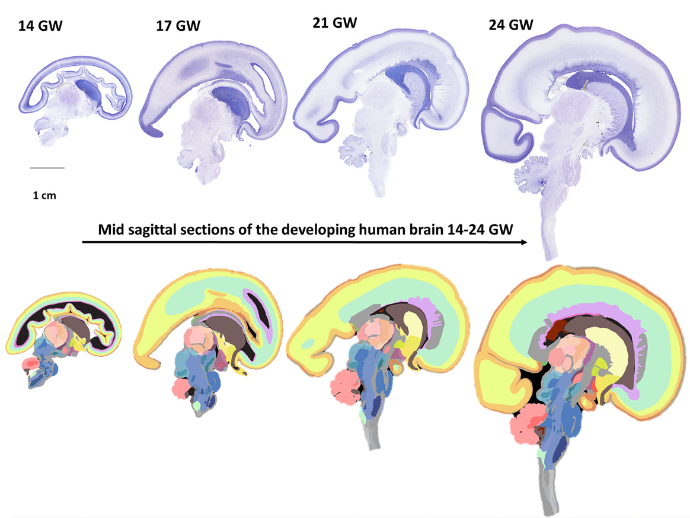

# DHARANI_data_tutorial
Tutorial for using DHARANI Dataset hosted on AWS Open Data

The jupyter [notebooks] in this repository are meant to demonstrate how the dataset can be programmatically accessed, visualized and interacted in python. 

To download the data directly from AWS Open Data, use the [directory-listings]

[directory-listings]:./directory-listings/
[notebooks]:./notebooks

## Abstract

We introduce DHARANI, the first online platform with three-dimensional (3D) histological reconstructions of the developing human brain from 14 to 24 gestational weeks (GW) across the five fetal brains. DHARANI features 5132 Nissl, hematoxylin and eosin stained, 20 µm coronal and sagittal sections, postmortem MRI, and a neuroanatomical atlas with 466 annotated sections covering ∼500 brain structures. It is accessible online at https://brainportal.humanbrain.in/publicview/index.html. The 3D reconstruction enables a volumetric view of the fetal brain, allowing visualization in all three planes akin to MRI, previously unachievable with histological datasets from the fetal brain. This allowed qualitative assessment of the growth of brain regions and layers throughout the second trimester. “DHARANI” documents the initiation of sulci, with the lateral fissure, calcarine, parieto-occipital, and cingulate sulci, at 14 GW. The central and postcentral sulci appear by 24 GW; however, cytoarchitectonic boundaries become visible before sulcal patterns. Cortical plate (CP) lamination begins at 24 GW in the parietal and occipital cortices. The frontal cortex lacks lamination at 24 GW, although putative Betz cells are already visible and show early patterning in the intermediate zone. The cell-sparse layer between the CP and subplate, containing late migratory neurons, begins in the orbital cortex at 14 GW and reaches the frontal cortex by 17 GW. The appearance of the honeycomb pattern in the occipital and parietal cortex occurs after 14 GW. Additionally, we describe the development of the thalamic pregeniculate with the rotation of the lateral geniculate nucleus. Cerebellar nuclei and an early Purkinje cell layer appear by 21 GW in the already foliated cerebellar cortex.

**DHARANI: A 3D Developing Human-brain Atlas Resource to Advance Neuroscience Internationally** -- Integrated Multimodal Imaging and High-resolution Histology of the second trimester
https://onlinelibrary.wiley.com/doi/toc/10.1002/(ISSN)1096-9861.DHARANI-A-3D-Developing-Human-brain

 

Verma, R., Bota, M., Ram, K., Jayakumar, J., Folkerth, R., Pandurangan, K., Ramesh, J.J., Majumder, M., Raveendran, R., Nanda, R., K, S., S, A.D., Karthik, S., Kumarasami, R., S, S., Lata, S., Kumar, E.H., Rangasami, R., Srinivasan, C., Kumutha, J., Vasudevan, S., Bhat, K., Sam C, C., Neelakantan, S., Savoia, S., Mitra, P.P., Joseph, J., Manger, P.R. and Sivaprakasam, M. (2025), DHARANI: A 3D Developing Human-Brain Atlas Resource to Advance Neuroscience Internationally Integrated Multimodal Imaging and High-Resolution Histology of the Second Trimester. J Comp Neurol, 533: e70006

doi: https://doi.org/10.1002/cne.70006

Shield: [![CC BY 4.0][cc-by-shield]][cc-by]

This work is licensed under a
[Creative Commons Attribution 4.0 International License][cc-by].

[![CC BY 4.0][cc-by-image]][cc-by]

[cc-by]: http://creativecommons.org/licenses/by/4.0/
[cc-by-image]: https://i.creativecommons.org/l/by/4.0/88x31.png
[cc-by-shield]: https://img.shields.io/badge/License-CC%20BY%204.0-lightgrey.svg