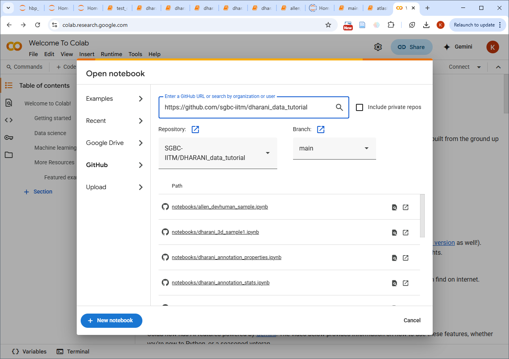

Dharani/docs/Getting started

[Back] to `docs`

[Back]:README.md

## Try on cloud (Google Colab)
1. `Open` a notebook in colab

In your web browser, visit https://colab.research.google.com

In the popup, select 'Github' on the left listing, and enter 
https://github.com/sgbc-iitm/DHARANI_data_tutorial, and click search

The repository notebooks should be listed, as shown in the screenshot below.
Select the notebook you want to execute

 

2. `Begin`` by Creating two blocks at the top of the notebook, 

Copy the below code and paste in the first block
 ```
! git clone https://github.com/sgbc-iitm/DHARANI_data_tutorial.git && pip install -r DHARANI_data_tutorial/requirements_3.10.txt
```

and execute it. Then copy-paste the below block

```
import sys
sys.path.append('DHARANI_data_tutorial')
```
and execute it.

3. Proceed with executing the rest of the blocks in the notebook.


## Local setup
Operational familiarity with a command line is required.

1. `clone` this github repository to your computer
[[cloning guidance]]

```
git clone https://github.com/SGBC-IITM/DHARANI_data_tutorial.git
```

[cloning guidance]: https://docs.github.com/en/repositories/creating-and-managing-repositories/cloning-a-repository

2. `get` prerequisites: python3.10 or newer; refer [python setup]

[python setup]: https://docs.python.org/3/using/index.html

3. `create` and `activate` python environment [[env guidance]]

``` 
python3 -m venv dharani_env
```

[windows]
``` 
source dharani_env\Scripts\activate
```

[*nix] 
```
 dharani_env/bin/activate
 ```

[env guidance]: https://packaging.python.org/en/latest/guides/installing-using-pip-and-virtual-environments/

4. `populate` the environment with packages listed in requirements_3.10.txt

```
pip install -r requirements_3.10.txt
```

## Regular use
  `activate` dharani_env, then

5. `start` jupyter [[starting]]

``` 
jupyter notebook
```

[starting]:https://docs.jupyter.org/en/latest/running.html

6. `open` jupyter in browser

```http://localhost:8888/tree```

7. Begin working

 Click a `ipynb` file in the `notebooks` folder to open it for running, or `create` a new notebook and start entering and evaluating code.

Enable the **ToC side bar** in the jupyter notebook 

*Menu Navigation* :: View->Left Sidebar -> Show Table of Contents

Refer [HowTo] for details.

[HowTo]: ../docs/HOWTO.md
